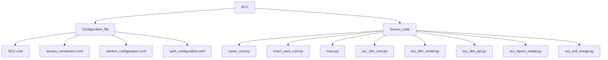

# Siding_Control_Centre_Module
**A Module of Cyber Signalling Software Architecture**

## SCC - Siding Control Centre Module.

## Configuration File - Files/settings that a program reads before startup.

## Source Code File - Files containing sub-modules.

### SCC.conf - SCC configuration file contains:-

    Comment- Description of file.
    Version - version of module.
    SSC_ID - SSC Identifier.
    Database - Object Containing database of provider, User, Password, HOST Protocol, HOST IP address, Database name
    Local MQTT Broker - Object Containing database of MQTT broker, Broker IP address, Username, Password, Port no. of the broker.
    Total yard.
    Total Section.

### Section.conf - Section Configuration File.

    It is the file containing the Detection Point direction in section IN and section OUT of all data points in a section.
    Syntax:-
    {
    "SECTION":[
    	{
    	"SECTION_ID": "S1",
    	"SECTION_IN":[
    		{
    		"DP_ID": "DP01",
    		"DP_DIRECTION": "IN"
    		},
    		{
    		"DP_ID": "DP02",
    		"DP_DIRECTION": "OUT"
    		},
    		{
    		"DP_ID": "DP03",
    		"DP_DIRECTION": "OUT"
    		}
    		],
    	"SECTION_OUT":[
    		{
    		"DP_ID": "DP01",
    		"DP_DIRECTION": "OUT"
    		},
    		{
    		"DP_ID": "DP02",
    		"DP_DIRECTION": "IN"
    		},
    		{
    		"DP_ID": "DP03",
    		"DP_DIRECTION": "IN"
    		}
    		]
    	}
    	]
    }

### Section_connection.conf - Section Configuration File.

    It is the file containing the state/setting of the section in Left Normal, Right Normal, Left Reverse, Right Reverse.
    Syntax:-
    {
	"SECTIONS": [
			{
			"SECTION_ID": "S1",
			"LEFT_NORMAL": "NONE",
			"RIGHT_NORMAL": "NONE",
			"LEFT_REVERSE": "NONE",
			"RIGHT_REVERSE": "NONE"
			}
		]
     }

### yard_connection.conf - yard Configuration File.

	It is the file containing DPU in the yard, sections under each DPU, and DP's in each section.
	Syntax:- 
	{
	"YARDS": [
		{
		"YARD_ID" : 1,
		"YARD_NAME" : "BHAUPUR_LOGICS",
		"DPU": [
			{
			"DPU_ID": "DPU_01",
			"DPU_NAME": "DPU_01",
			"SECTIONS":[
					{
					"SECTION_ID": "S1",
					"SECTION_NAME": "S1",
					"DPS" : ["DP01"]
					},
					{
					"SECTION_ID": "S2",
					"SECTION_NAME": "S2",
					"DPS" : ["DP01","DP02","DP03"]
					},
					{
					"SECTION_ID": "S3",
					"SECTION_NAME": "S3",
					"DPS" : ["DP02"]
					},	
					{
					"SECTION_ID": "S4",
					"SECTION_NAME": "S4",
					"DPS" : ["DP04","DP03","DP05"]
					}											
	
				]
			   }
			]
		   }
		]
	}
	

### scc_dlm_conf.py - module to load data (comment, version, lmb(local mqtt broker), scc_id) from configuration files.

***Class SccDlmConfRead:***

**def read_cfg(self, file_name):** 

Convert JSON file to python file.

Match this Python file with a Schema dictionary(a class object inside this Class) and validate it by calling the validate_cfg() function.

load data (comment, version, lmb(local mqtt broker), scc_id) from python file to Class DatabaseStruct class objects.

**def validate_cfg(self):** 

function to check if any data (comment, version, lmb(local mqtt broker), scc_id, PROVIDER, USER, PASSWORD, HOST, DB_NAME) is not present, empty, or whitespace.

***Class DatabaseStruct(NamedTuple):***
    PROVIDER: str
    USER: str
    PASSWORD: str
    HOST: str
    DB_NAME: str

                    
### scc_dlm_model.py - Module to create tables in the database. 
We have created tables for SectionConfigInfo, DPInfo, SectionInfo, SecionPlaybackInfo, TrainTraceInfo, YardPerformanceInfo, TorpedoPerformanceInfo, YardConfigInfo, OccUserInfo, EventInfo, PointConfig, TrailThroughInfo, TrailThroughPlayback.

### scc_layout_model.py - Module to create tables in the database.
We have created tables for LayoutSectionInfo, and LayoutSectionConnectionsInfo.

### scc_dlm_api.py - data logging module to handle all API in scc website.

***class TrainEntryExitTrace():*** - initializing Train entry and exit trace objects.
***class SectionConnections:*** - initializing Section Connection objects.
***class Torpedo:*** - initializing Torpedo Info objects.

***class SccAPI:***
**def connect_database(self, config):** - Connect passed argument file to postgresql database.
**def get_user_roles(self, username_param):** - provide user role of passed username from OccUserInfo table.
**def get_dpu_id(self, section_id_param):** - provide dpu id of passed section_id from YardConfig Table.
**def insert_section_info(self, data):** - insert passed data into SectionInfo Table.
**def insert_section_playback_info(self, data):** - saving passed data to section_playback_table.
**def read_section_playback_info(self):** -log section_id and section_status from section_playback_table.
**def insert_dp_info(self, data):** - insert passed data into dp_Info Table.
**def select_section_info(self):** - Return all records from SectionInfo table.
**def read_section_config_info(self):** - return all records from section_config_info table.
**def read_yard_config_info(self):** - Return all records from yard_config_info table.
**def read_section_connections_info(self):** - Return all records from the layout Section Connection table.
**def reset_train_trace_info(self):** - Reset train_trace_obj_list.

### scc_trail_through.py - module to detect trail through and torpedo status.
***Class Sec:*** - Initialised Section Variables.

***Class Trailthrough:***
**def get_point_config(self):** - function to return section_id and
point_id from PointConfig table.

**def init_trail_through_info(self):** - add records on tt_sec_obj_list ['section_id and point_id by calling get_point_config' & 'section config objects by calling scc_api.read_section_connections_info() function.

**def detect_trail_through(self, section_json_data, point_obj_list):** - function to detect trail through using passed section_json_data and point_obj_list.

**def find_torpedo_status(self, section_json_data):** - finding torpedo status by using objects of tt_sec_obj_list.

**def construct_section_json_msg(self):** - return json_msg with key1 as "timestamp" & key2 as (object of tt_section_msg_list).

### main.py - main module for yard configuration and section information.

### insert_conf.py - A module containing functions to convert (JSON files to Python) and (Python to JSON).
Class SectonConfig:

def read_cfg(self, file_name): function to convert JSON file to Python file.

def print_cfg(self): function to convert Python file to JSON file.

### insert_yard_conf.py - A module containing functions to convert (JSON file to Python) and (python to JSON).
Class SectonConfig:

def read_cfg(self, file_name): function to convert JSON file to Python file.

def print_cfg(self): function to convert Python file to JSON file.
