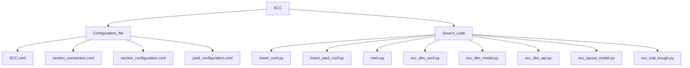

# Siding_Control_Centre_Module
**A Module of Cyber Signalling Software Architecture**

## SCC - Siding Control Centre Module.

## Configuration File - Files/settings that a program reads before startup.

## Source Code File - Files containing sub-modules.

### SCC.conf - SCC configuration file contains:-

    Comment- Description of file.
    Version - version of module.
    SSC_ID - SSC Identifier.
    Database - Object Containing database of provider, User, Password, HOST Protocol, HOST IP address, Database name
    Local MQTT Broker - Object Containing database of MQTT broker, Broker IP address, Username, Password, Port no. of the broker.
    Total yard.
    Total Section.

### Section.conf - Section Configuration File.

    It is the file containing the Detection Point direction in section IN and section OUT of all data points in a section.
    Syntax:-
    {
    "SECTION":[
    	{
    	"SECTION_ID": "S1",
    	"SECTION_IN":[
    		{
    		"DP_ID": "DP01",
    		"DP_DIRECTION": "IN"
    		},
    		{
    		"DP_ID": "DP02",
    		"DP_DIRECTION": "OUT"
    		},
    		{
    		"DP_ID": "DP03",
    		"DP_DIRECTION": "OUT"
    		}
    		],
    	"SECTION_OUT":[
    		{
    		"DP_ID": "DP01",
    		"DP_DIRECTION": "OUT"
    		},
    		{
    		"DP_ID": "DP02",
    		"DP_DIRECTION": "IN"
    		},
    		{
    		"DP_ID": "DP03",
    		"DP_DIRECTION": "IN"
    		}
    		]
    	}
    	]
    }

### Section_connection.conf - Section Configuration File.

    It is the file containing the state/setting of the section in Left Normal, Right Normal, Left Reverse, Right Reverse.
    Syntax:-
    {
	"SECTIONS": [
			{
			"SECTION_ID": "S1",
			"LEFT_NORMAL": "NONE",
			"RIGHT_NORMAL": "NONE",
			"LEFT_REVERSE": "NONE",
			"RIGHT_REVERSE": "NONE"
			}
		]
     }

### yard_connection.conf - Section Configuration File.

	It is the file containing DPU in yard, sections under each DPU, DP's in each section.
	Syntax:- 
	{
	"YARDS": [
		{
		"YARD_ID" : 1,
		"YARD_NAME" : "BHAUPUR_LOGICS",
		"DPU": [
			{
			"DPU_ID": "DPU_01",
			"DPU_NAME": "DPU_01",
			"SECTIONS":[
					{
					"SECTION_ID": "S1",
					"SECTION_NAME": "S1",
					"DPS" : ["DP01"]
					},
					{
					"SECTION_ID": "S2",
					"SECTION_NAME": "S2",
					"DPS" : ["DP01","DP02","DP03"]
					},
					{
					"SECTION_ID": "S3",
					"SECTION_NAME": "S3",
					"DPS" : ["DP02"]
					},	
					{
					"SECTION_ID": "S4",
					"SECTION_NAME": "S4",
					"DPS" : ["DP04","DP03","DP05"]
					}											
	
				]
			   }
			]
		   }
		]
	}
	

### scc_dlm_conf.py - data logging module configuration. It reads data from "scc.conf" validates it and stores it in the database.
                    
### scc_dlm_model.py - data logging module to store data in PostgreSQL.

### scc_layout_model.py - data logging module for layout section data to store data in PostgreSQL.

### scc_dlm_api.py - data logging module to handle all API in scc website.

### scc_trail_through.py - module to detect trail through and torpedo status.

### main.py - main module for yard configuration and section information.

### insert_conf.py - A module to take Siding Control Centre configuration insertion.

### insert_yard_conf.py - A module to take yard configuration insertion.

### scc_log.py - module to set-up logging.
